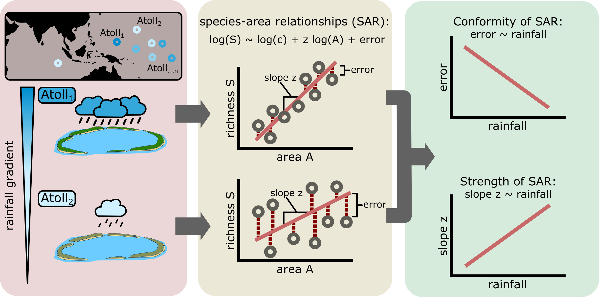

# Modeling conformity of SAR

Abstract

## Workflow



We compiled island-level biodiversity data for 19 atolls from literature reports, along with cumulative annual rainfall measurements and the frequency of tropical cyclone encounters per atoll.
We then computed the species-area relationship (SAR) following Arrhenius' Power Law, which relates island species richness S to island area A through a log-log linear relationship with intercept c and slope z.
Then, we determined the effect of rainfall and cyclone disturbance frequency on the slope parameter and the residual error in the species-area relationship, using Bayesian Distributional Modelling (i.e., Bayesian Heteroscedastic Modelling).
We tested the hypotheses that higher rainfall amounts reduce the residual error (i.e. the ‘noise’) in species-area relationship, and increase the slope of the relationship.

## Cite

```bibtex
@article{steibl2025sar,
  title={Rainfall increases conformity and strength of species area relationships in atolls},
  author={Steibl, Sebastian and Steiger, Simon and Valente, Luís and Russell, James C},
  journal={submitted},
  year={2025}
  doi={tbd}
}
```

## Installation

### R script

To run the core data analysis:

1. Install the R programming language ([Windows](https://cran.r-project.org/bin/windows/), [MacOS](https://cran.r-project.org/bin/macosx/), [Linux](https://cran.r-project.org/bin/linux/)) (Version 4.4.0 or later)
2. Install the `renv` package by running `install.packages("renv")`
3. Open an R console in the project folder `SAR-conformity`
4. Run `renv::activate()` and restart the R session
5. Run `renv::restore()` to download all dependencies from the lock file

### Julia script

To run the simulation:

1. Open the file `simulation.html` 
2. Follow the installation tutorial by clicking "Edit or run this notebook" in the top right of the window
